# Integration cookbook

**Status:** Pre-implementation — **docs-only** pairing; zero npm coupling to sibling libraries.

How to compose `llm-stream-mux` with [`llm-stream-assemble`](https://github.com/01laky/llm-stream-assemble) and `llm-stream-guard` in userland. Install each package separately; no imports between them inside any library.



---

## Prerequisites

- Node.js 18+ (Web Streams, `AbortController`, `AbortSignal.timeout`)
- Your own HTTP client and auth
- Optional: `llm-stream-assemble` for parsing, guard for filtering

---

## Decision table

| I need…                             | Pattern                           | mux strategy                          |
| ----------------------------------- | --------------------------------- | ------------------------------------- |
| Fastest provider wins raw SSE bytes | race bodies, then assemble winner | `race<Uint8Array>` → `assembleStream` |
| Primary model with backup           | lazy fallback thunks              | `fallback`                            |
| Multi-model panel / ensemble UI     | merge tagged streams              | `merge` + `Tagged<T>`                 |
| Log + client from one stream        | tee with `bounded` or `drop`      | `tee`                                 |
| Parse then orchestrate events       | assemble each source first        | `merge` on event type                 |
| Orchestrate then filter             | mux then guard transform          | userland pipe                         |

---

## Byte mode: race → assemble

Race raw provider bodies; hand the winner to assemble (no mux → assemble import):

```ts
import { race, toReadable } from "llm-stream-mux";
import { assembleStream, openaiChatAdapter } from "llm-stream-assemble";

const winner = race<Uint8Array>([resA.body!, resB.body!], { signal, timeoutMs: 5000 });

for await (const event of assembleStream(toReadable(winner), openaiChatAdapter())) {
	if (event.type === "text.delta") process.stdout.write(event.text);
}
```

Diagram: [byte-event-modes.svg](./img/byte-event-modes.svg).

---

## Event mode: assemble → merge

```ts
import { merge } from "llm-stream-mux";
import { assembleStream, openaiChatAdapter, anthropicAdapter } from "llm-stream-assemble";

const sources = {
	openai: assembleStream(openaiBody, openaiChatAdapter()),
	anthropic: assembleStream(anthropicBody, anthropicAdapter()),
};

for await (const tagged of merge(sources, {
	isError: (e) => e.type === "error",
	onSourceEvent: (s) => metrics(s),
})) {
	if (tagged.kind === "value") ui.render(tagged.source, tagged.value);
}
```

---

## mux → guard (event mode)

Apply guard transforms after mux forwards a single stream, or map each merged branch in your app — guard is a separate 1→1 filter:

```ts
// Pseudocode — exact guard API lives in llm-stream-guard docs
const merged = merge({ a: streamA, b: streamB });
for await (const tagged of merged) {
	if (tagged.kind !== "value") continue;
	const safe = guardTransform(tagged.value);
	render(tagged.source, safe);
}
```

---

## Proxy SSE pattern

```ts
import { race, toReadable } from "llm-stream-mux";

const winner = race<Uint8Array>([primary.body!, backup.body!], { signal });

return new Response(toReadable(winner), {
	headers: { "Content-Type": "text/event-stream" },
});
```

---

## Framework notes

| Runtime            | Notes                                                                |
| ------------------ | -------------------------------------------------------------------- |
| Node 18+           | `fetch` Response bodies are `ReadableStream` — ideal for hard cancel |
| Cloudflare Workers | Web Streams native; use `ReadableStream` sources for race/fallback   |
| Deno / Bun         | Same Web Streams surface; no `node:stream` in mux `src/`             |

See [compatibility.md](./compatibility.md).

---

## Related

- [llm-stream-assemble integration cookbook](https://github.com/01laky/llm-stream-assemble/blob/main/docs/integration-cookbook.md)
- [Usage guides](./usage-guides.md)
- [Comparison](./comparison.md)
