# Testing strategy

**Status:** **972** tests in CI via `pnpm verify`. Current release: **`1.1.0`** (stable; API frozen as of **`1.0.0`**).



---

## Runner

- **Vitest** — `pnpm test` after `pnpm build` (release tests assert `dist/` artifacts).
- **Examples** — `pnpm typecheck:examples` after build; **`LSM-REL-10a`** in release tests.
- **Multi-runtime** — `pnpm smoke:runtimes --ci` in **`smoke-runtimes.yml`** (Bun + Deno).
- **Maintainer** — **`pnpm verify:pre1`** adds release-prep + smoke:runtimes + smoke:consumer + **smoke:published**.
- **Doc links** — **`node scripts/verify-doc-links.mjs`** (file + anchor audit; **`LSM-REL-12f`**).
- Test IDs in titles: `it("LSM-EDGE-16 race break loser race-lost winner aborted", …)`.

---

## Areas

| Prefix        | Scope                                               | Status                                   |
| ------------- | --------------------------------------------------- | ---------------------------------------- |
| `LSM-REL`     | release, build, export map, package smoke           | **P0–P10** — `LSM-REL-01`–`12u`          |
| `LSM-TYP`     | public type shapes, hooks, enums, d.ts contract     | **P0+P1** — `LSM-TYP-01`–`69`            |
| `LSM-EDGE-P0` | matrix error-code prelude before runtime            | **P0** — `LSM-EDGE-P0-01`–`26`           |
| `LSM-SRC`     | Source union fixture edge cases (pre-runtime)       | **P0** — `LSM-SRC-01`–`12`               |
| `LSM-CORE`    | normalizeSource, abort, interop, telemetry, queue   | **P1+P6** — `LSM-CORE-01`–`70`           |
| `LSM-TEE`     | N-way tee, backpressure policies, cancel            | **P2** — `LSM-TEE-01`–`64`               |
| `LSM-RACE`    | first usable, loser cancel, commit                  | **P3** — `LSM-RACE-01`–`80`              |
| `LSM-FB`      | lazy failover, FailoverPolicy, ALL_FAILED           | **P4** — `LSM-FB-01`–`110`               |
| `LSM-MERGE`   | Tagged output, read-loop, concurrency, backpressure | **P5** — `LSM-MERGE-01`–`135`            |
| `LSM-X`       | timeouts, mapEach, onFinish, HWM cross-cutting      | **P6** — `LSM-X-01`–`115`                |
| `LSM-EDGE`    | full behavioral contract matrix + no-leak audit     | **P7–P10** — `LSM-EDGE-01`–`180` + `06b` |

Proposal §24 examples AC satisfied by **`LSM-REL-10a`** (examples typecheck) and **`LSM-REL-10d`** (README quickstart).

---

## P10 test files

| File                           | IDs                  | Count |
| ------------------------------ | -------------------- | ----- |
| `scripts/verify-doc-links.mjs` | link + anchor audit  | —     |
| `scripts/smoke-published.mjs`  | post-pack consumer   | —     |
| `test/edge.test.ts`            | `LSM-EDGE-140`–`180` | 41    |
| `test/release.test.ts`         | `LSM-REL-12a`–`12u`  | 21    |

**`LSM-REL-10f`** — edge matrix **`01`–`180`** + **`§H`**; **`LSM-REL-11l`** — §G authority through **`139`**; **`LSM-REL-12e`** — §H integrity through **`179`**.

Prior P9 **`LSM-REL-11a`–`11q`** and P8 **`LSM-REL-10a`–`10f`** unchanged.

 · [Publish ceremony](./img/publish-ceremony.svg)

---

## Portability gate

`scripts/check-portability.mjs` runs as **`pnpm verify:portability`** — fails if `src/` contains:

- `ReadableStream.from`
- native `.tee(` on ReadableStream
- `node:stream` / `node:events` / `node:buffer` imports
- `ReadableStream[Symbol.asyncIterator]`

---

## Verify pipeline

```bash
pnpm verify
pnpm verify:pre1    # maintainer: verify + release:prep + smoke:runtimes + smoke:consumer + smoke:published
node scripts/verify-doc-links.mjs
```

Order: `verify:deps` → `verify:portability` → lint → typecheck → build → **`typecheck:examples`** → test → smoke:package → verify:docs → diagrams:check → format

**`release:prep`** / **`release:prep --full`** runs inside **`LSM-REL-10c`** / **`LSM-REL-11c`** / **`LSM-REL-12n`** (not duplicated in verify script).

**`pnpm smoke:runtimes --skip-optional`** — local Node-only; **`--ci`** requires Bun + Deno (see **`smoke-runtimes.yml`**).

**`pnpm smoke:published --all-runtimes`** — optional Node 22/24 cross-runtime ( **`release:prep --full`** ).

CI matrix: Node **22, 24** (`LSM-REL-12s`).

---

## Related

- [API stability policy](./STABILITY.md)
- [Security policy](../SECURITY.md)
- [Release templates](./RELEASE.md)
- [Edge-case matrix §G](./edge-cases.md#g-contract-matrix-binding-p7-070)
- [Edge-case matrix §H](./edge-cases.md#h-ultra-extended-h-100-production-matrix-lsm-edge-140180)
- [Examples](../examples/README.md)
- [Edge matrix diagram](./img/edge-matrix.svg)
- [Proposal Part B](./proposal.MD#part-b-implementation-roadmap)
